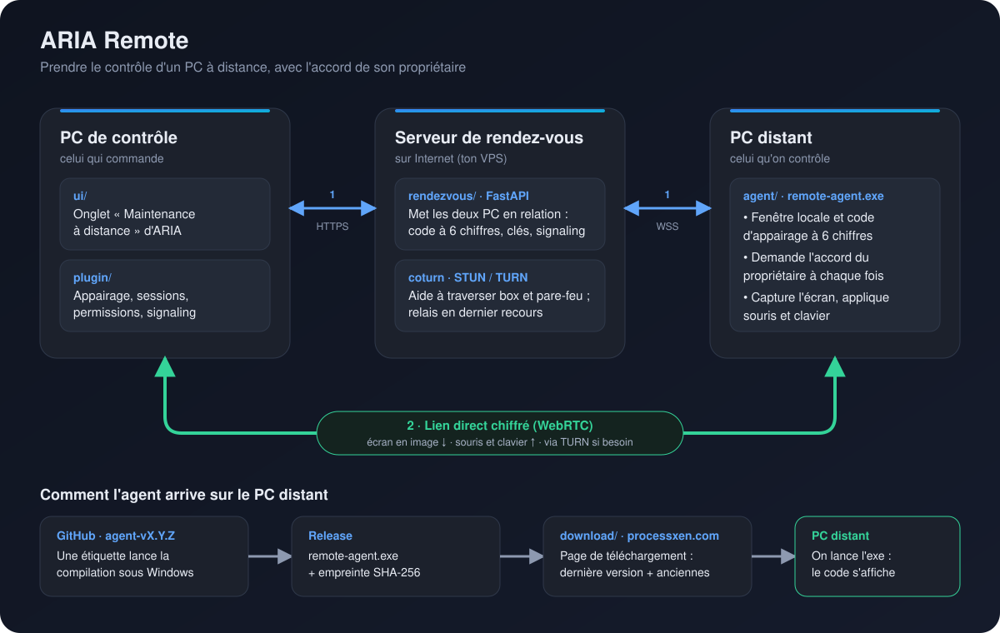

# ARIA Remote

Contrôle d'un PC à distance, sécurisé : un **agent Windows** (fenêtre locale, code d'appairage à 6 chiffres), un **serveur de rendez-vous** (WebRTC, STUN/TURN), un **plugin** et une **interface** pour ARIA (PC Assistant), et la **page de téléchargement** de l'agent.

**Comment ça marche :**
1. Les deux PC se connectent au **serveur de rendez-vous** (le contrôleur en HTTPS, l'agent en WSS). Le code à 6 chiffres affiché par l'agent sert à les appairer.
2. Une fois appairés, ils échangent **directement** l'écran, la souris et le clavier, chiffrés (WebRTC). Le serveur ne voit pas passer l'écran ; seul le relais TURN sert en dernier recours.
3. Le propriétaire du PC distant **accepte chaque prise de contrôle** et choisit ce qui est autorisé (souris, clavier).

| Dossier | Contenu |
|---|---|
| `agent/` | l'agent Rust (`remote-agent.exe`) : capture, souris, clavier, fenêtre locale |
| `rendezvous/` | le serveur public (FastAPI + coturn), déploiement VPS/Docker |
| `download/` | la page de téléchargement (nginx), construite depuis les releases de ce dépôt |
| `desktop/` | l'application de bureau pour contrôler un PC (Tauri 2, Rust), en cours de démarrage |
| `plugin/` | le plugin Remote d'ARIA (appairage, sessions, signaling) |
| `ui/` | l'onglet « Maintenance à distance » d'ARIA (React) |
| `docs/` | architecture et sécurité (`REMOTE_ARCHITECTURE.md`) |

## Versions
L'agent suit son propre numéro (`agent/Cargo.toml`). Une release se publie avec une étiquette identique : `git tag agent-v1.5.0 && git push origin agent-v1.5.0`. L'application de bureau a sa propre version et ses propres étiquettes : `desktop-vX.Y.Z`.
La compilation refuse une étiquette qui ne correspond pas au `Cargo.toml`. La page de téléchargement se met à jour **toute seule** quand une version est publiée (voir `download/README.md`) : elle affiche la dernière version et garde les anciennes.

Les versions 0.1.0 à 0.1.4 ont été publiées dans le dépôt `pc-assistant`, dont ce projet est issu.
