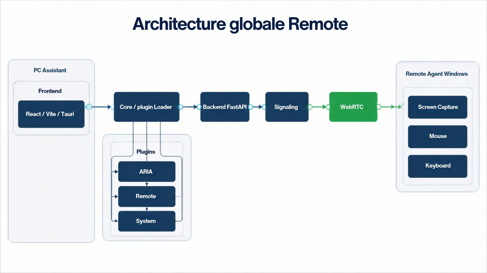
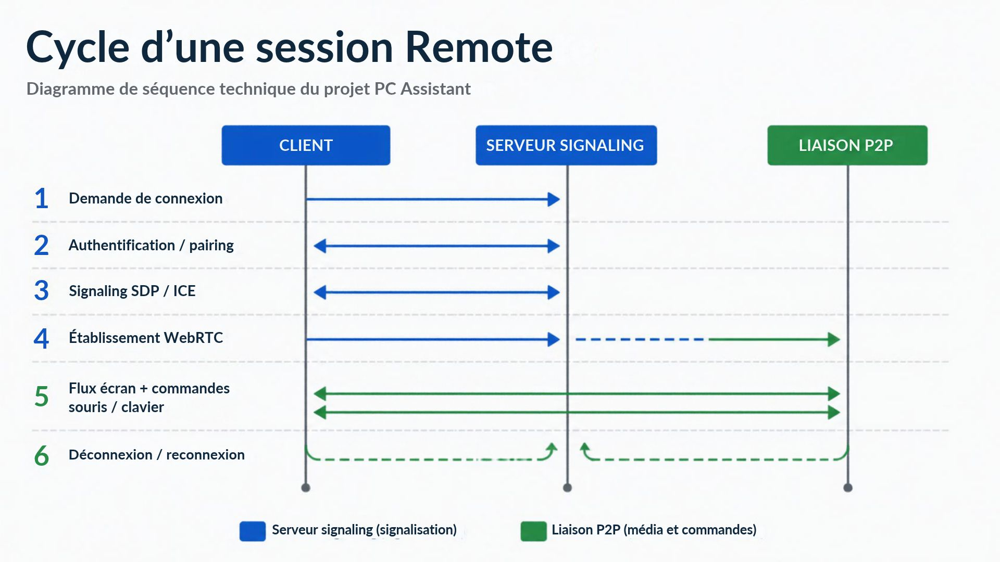
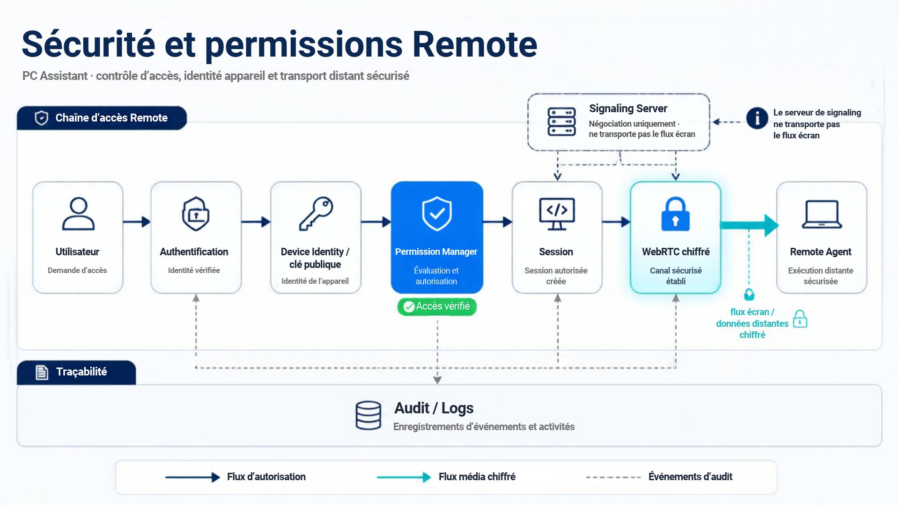

# PC Assistant — Remote Control
## Architecture technique complète et évolutive

> **Document de référence pour l'extension Remote de PC Assistant.**
>
> Cette documentation décrit une V1 simple à implémenter tout en conservant une architecture suffisamment solide pour évoluer ensuite vers un système comparable à TeamViewer / AnyDesk.
>
> Les trois schémas ci-dessous utilisent les images fournies dans `docs/images/`.

---

# 1. Objectif

Le module **Remote** permet à PC Assistant de prendre en charge un ordinateur distant de manière contrôlée et authentifiée.

La V1 doit rester volontairement limitée :

- appairage par code temporaire à 6 chiffres ;
- affichage de l'écran distant ;
- contrôle de la souris ;
- contrôle du clavier ;
- permissions explicites ;
- authentification de l'appareil ;
- journalisation des événements importants ;
- reconnexion propre.

L'objectif n'est pas de construire immédiatement toutes les fonctions d'AnyDesk ou TeamViewer.

L'objectif est de construire **le socle technique correct** afin que les fonctionnalités supplémentaires puissent être ajoutées sans casser l'architecture.

---

# 2. Positionnement dans PC Assistant

Remote n'est pas une application indépendante.

Il devient un **plugin natif de PC Assistant**, utilisant le système de plugins déjà présent dans le projet.

La relation générale est :

```text
ARIA
  │
  ▼
PC Assistant
  │
  ├── Core / Plugin Loader
  │
  ├── Plugins existants
  │
  └── Remote Plugin
        │
        ├── Backend FastAPI
        ├── Frontend React / Vite / Tauri
        ├── Signaling
        └── Remote Agent Windows
                    │
                    ├── Capture écran
                    ├── Souris
                    ├── Clavier
                    └── WebRTC
```

**ARIA reste l'orchestrateur.**

Le plugin Remote fournit les capacités de contrôle distant.

ARIA pourra donc plus tard demander au système :

```text
ARIA
 → "connecte-moi au PC-X"
 → Plugin Remote
 → création de session
 → authentification
 → connexion WebRTC
 → contrôle distant
```

ARIA ne doit pas contenir directement le code de capture écran ou d'injection clavier.

---

# 3. Architecture globale


## Architecture globale Remote

Ce diagramme montre la position de Remote dans l'architecture existante de PC Assistant.




## Cycle d'une session Remote

Ce diagramme montre le déroulement d'une connexion distante, du pairing jusqu'à la reconnexion.




## Sécurité et permissions Remote

Ce diagramme montre la chaîne d'autorisation, l'identité de l'appareil, le chiffrement et l'audit.



### Lecture du diagramme

L'architecture est organisée en couches.

### ARIA

ARIA représente la couche d'intelligence et d'orchestration.

Elle peut demander une opération Remote mais ne doit pas connaître les détails bas niveau de Windows.

Exemples :

```text
"Connecte-moi au PC du bureau"
"Affiche l'écran distant"
"Prends le contrôle de la souris"
"Déconnecte la session"
```

### Core / Plugin Loader

Le système de plugins existant de PC Assistant reste la base.

Le plugin Remote doit utiliser ce mécanisme au lieu de créer un deuxième système de plugins.

Le Core ne doit pas dépendre du plugin Remote.

La dépendance doit rester :

```text
Core
  ↑
Remote Plugin
```

et jamais :

```text
Remote Plugin
  ↓
Core modifié spécifiquement pour Remote
```

### Backend FastAPI

Le backend gère les fonctions de contrôle et d'orchestration :

- création des sessions ;
- authentification ;
- pairing ;
- gestion des appareils ;
- permissions ;
- signaling ;
- état de session ;
- journalisation.

Le backend ne doit pas devenir le transport principal de la vidéo.

### Frontend React / Vite / Tauri

Le frontend fournit l'interface utilisateur :

- liste des appareils ;
- code de connexion ;
- état de la session ;
- écran distant ;
- commandes souris ;
- commandes clavier ;
- permissions ;
- bouton de déconnexion.

### Remote Agent Windows

L'Agent est installé sur le PC qui doit être contrôlé.

Il est séparé du backend PC Assistant car il doit effectuer les opérations spécifiques au système Windows :

- capture écran ;
- gestion souris ;
- gestion clavier ;
- identité de l'appareil ;
- communication WebRTC ;
- gestion des permissions locales.

Pour cette partie, **Rust** est recommandé.

---

# 4. Pourquoi un Remote Agent séparé ?

Le backend FastAPI ne doit pas directement manipuler le bureau Windows.

Une architecture propre sépare :

```text
PC Assistant Backend
        │
        │ réseau
        ▼
Remote Agent
        │
        ▼
Windows
```

Cette séparation permet :

- de limiter les privilèges ;
- de sécuriser l'accès ;
- de redémarrer l'agent indépendamment ;
- de faire évoluer l'agent sans modifier FastAPI ;
- de supporter d'autres plateformes plus tard.

L'Agent pourra ensuite devenir une abstraction :

```text
Remote Agent Windows
Remote Agent Linux
Remote Agent macOS
Remote Agent Raspberry Pi
```

---

# 5. Cycle d'une session

Le cycle recommandé est :

```text
1. Demande de connexion
        ↓
2. Pairing / authentification
        ↓
3. Vérification des permissions
        ↓
4. Signaling SDP / ICE
        ↓
5. Établissement WebRTC
        ↓
6. Flux écran + commandes
        ↓
7. Déconnexion ou reconnexion
```

## 5.1 Demande de connexion

L'utilisateur demande une connexion à un appareil.

Exemple :

```text
PC-XXXXXXXX
```

ou, pour la V1 :

```text
Code : 483921
```

Le code est temporaire.

Il ne doit pas devenir l'identité permanente de l'appareil.

---

# 6. Identité de l'appareil

L'appareil doit posséder une identité persistante.

Concept :

```text
device_id
public_key
private_key
metadata
```

La clé privée reste exclusivement sur l'appareil.

Le serveur connaît la clé publique.

Exemple conceptuel :

```text
Device
 ├── device_id
 ├── public_key
 └── private_key   ← ne quitte jamais l'appareil
```

Le code à 6 chiffres sert uniquement au pairing.

Il ne remplace pas une identité cryptographique.

---

# 7. Permissions

Les permissions doivent être séparées.

Exemple :

```text
view_screen
control_mouse
control_keyboard
clipboard
file_read
file_write
reboot
shutdown
terminal
```

La V1 peut commencer avec :

```text
view_screen
control_mouse
control_keyboard
```

Cela permet ensuite d'ajouter les fonctions sans modifier le modèle de sécurité.

---

# 8. Signaling et WebRTC

Le signaling et le transport réel doivent être séparés.

## Signaling

Le serveur échange uniquement les informations nécessaires pour établir la connexion :

```text
SDP
ICE candidates
session_id
device_id
permissions
```

Il ne doit pas devenir le tunnel vidéo.

## WebRTC

Une fois la négociation terminée :

```text
Client
   ⇅
WebRTC
   ⇅
Remote Agent
```

Le flux écran et les commandes transitent par la connexion temps réel.

Cela permet :

- faible latence ;
- connexion directe lorsque possible ;
- chiffrement ;
- meilleure évolutivité.

---

# 9. NAT et TURN

Toutes les connexions ne pourront pas être établies directement.

Il faut prévoir :

```text
STUN
  │
  ├── connexion directe possible
  │
  └── sinon
        ↓
      TURN
```

Pour une infrastructure contrôlée, **coturn** peut être utilisé comme serveur TURN.

Le serveur TURN sert de relais réseau lorsque la connexion directe n'est pas possible.

Il ne remplace pas le serveur de signaling.

---

# 10. États d'une session

La session doit utiliser une machine d'état claire.

```text
CREATED
   ↓
WAITING
   ↓
AUTHENTICATING
   ↓
CONNECTING
   ↓
CONNECTED
   │
   ├── RECONNECTING
   │       ↓
   │   CONNECTED
   │
   ↓
DISCONNECTED
```

Cette approche évite les états implicites dispersés dans le code.

---

# 11. API Backend proposée

Préfixe :

```text
/api/remote
```

Endpoints V1 :

```text
POST   /api/remote/pair
POST   /api/remote/sessions
GET    /api/remote/sessions/{session_id}
DELETE /api/remote/sessions/{session_id}

GET    /api/remote/devices
GET    /api/remote/devices/{device_id}

POST   /api/remote/signaling/offer
POST   /api/remote/signaling/answer
POST   /api/remote/signaling/ice
```

Le détail exact des routes pourra être ajusté à la convention déjà utilisée par PC Assistant.

---

# 12. Plugin Remote

Le plugin doit respecter l'architecture existante.

Structure cible :

```text
backend/
└── plugins/
    └── remote/
        ├── __init__.py
        ├── manifest.json
        ├── router.py
        ├── service.py
        └── chat_handler.py
```

## manifest.json

Concept :

```json
{
  "id": "remote",
  "name": "Contrôle à distance",
  "version": "0.1.0",
  "description": "Contrôle sécurisé d'un PC distant",
  "enabled_by_default": false,
  "router_prefix": "/api/remote",
  "chat_handler": true,
  "chat_handler_order": 70,
  "frontend": {
    "component": "RemoteControl",
    "tab": {
      "id": "remote",
      "label": "Remote",
      "order": 70
    }
  }
}
```

Le plugin doit donc être chargé par le mécanisme existant de `plugin_loader.py`.

---

# 13. Frontend

Composant principal :

```text
frontend/
└── src/
    └── components/
        └── RemoteControl.jsx
```

Le frontend doit être chargé via le système dynamique déjà utilisé par PC Assistant.

Interface V1 :

```text
┌──────────────────────────────────────────────┐
│ REMOTE                                       │
├──────────────────────────────────────────────┤
│                                              │
│  Appareils                                   │
│                                              │
│  PC-BUREAU          ● Disponible             │
│  PC-SALON           ● Hors ligne             │
│                                              │
│  Code de connexion : [ 483921 ]              │
│                                              │
│              [ Se connecter ]                │
│                                              │
└──────────────────────────────────────────────┘
```

Pendant la connexion :

```text
┌──────────────────────────────────────────────┐
│ PC-BUREAU                         CONNECTÉ   │
├──────────────────────────────────────────────┤
│                                              │
│                                              │
│            ÉCRAN DISTANT                     │
│                                              │
│                                              │
├──────────────────────────────────────────────┤
│ Souris : ON   Clavier : ON   [Déconnecter]  │
└──────────────────────────────────────────────┘
```

---

# 14. Remote Agent

Architecture recommandée :

```text
remote-agent/
├── Cargo.toml
└── src/
    ├── main.rs
    ├── agent.rs
    ├── session.rs
    │
    ├── capture/
    │   └── screen.rs
    │
    ├── input/
    │   ├── mouse.rs
    │   └── keyboard.rs
    │
    └── network/
        ├── signaling.rs
        └── webrtc.rs
```

Chaque responsabilité est isolée.

---

# 15. Sécurité

Le modèle de sécurité doit suivre cette chaîne :

```text
Utilisateur
    ↓
Identité appareil
    ↓
Authentification
    ↓
Permissions
    ↓
Session autorisée
    ↓
Canal sécurisé
    ↓
Remote Agent
    ↓
Action Windows
```

Aucune action sensible ne doit être exécutée simplement parce qu'une connexion réseau existe.

---

# 16. Audit

Les événements importants doivent pouvoir être enregistrés.

Exemples :

```text
SESSION_CREATED
PAIRING_REQUESTED
PAIRING_ACCEPTED
AUTHENTICATION_SUCCESS
AUTHENTICATION_FAILED
PERMISSION_GRANTED
PERMISSION_DENIED
REMOTE_CONNECTED
REMOTE_DISCONNECTED
KEYBOARD_CONTROL_ENABLED
MOUSE_CONTROL_ENABLED
```

Exemple :

```json
{
  "event": "REMOTE_CONNECTED",
  "session_id": "sess_xxxxx",
  "device_id": "dev_xxxxx",
  "timestamp": "2026-10-06T00:00:00Z"
}
```

---

# 17. Permissions Windows

Le Remote Agent doit être identifiable par l'utilisateur.

Il ne doit pas chercher à fonctionner de manière cachée.

Il doit être possible de :

- voir que l'agent est installé ;
- arrêter l'agent ;
- désinstaller l'agent ;
- consulter son état ;
- voir les permissions ;
- refuser une connexion ;
- couper immédiatement une session.

Les protections Windows comme l'UAC doivent être respectées.

---

# 18. Séparation des responsabilités

## ARIA

Responsable de :

- compréhension des demandes ;
- orchestration ;
- automatisation ;
- raisonnement.

## PC Assistant Core

Responsable de :

- chargement des plugins ;
- configuration ;
- infrastructure commune ;
- API principale.

## Remote Plugin

Responsable de :

- logique Remote ;
- sessions ;
- pairing ;
- permissions ;
- API Remote ;
- interface Remote.

## Remote Agent

Responsable de :

- capture écran ;
- clavier ;
- souris ;
- WebRTC ;
- intégration Windows.

Cette séparation est fondamentale pour garder le projet maintenable.

---

# 19. Arborescence globale cible

```text
pc-assistant/
│
├── backend/
│   ├── main.py
│   ├── plugin_loader.py
│   │
│   └── plugins/
│       ├── calendar/
│       ├── files/
│       ├── messaging/
│       ├── system/
│       ├── image_generation/
│       ├── pointer_calibration/
│       ├── quiz/
│       │
│       └── remote/
│           ├── __init__.py
│           ├── manifest.json
│           ├── router.py
│           ├── service.py
│           └── chat_handler.py
│
├── frontend/
│   └── src/
│       ├── pluginComponents.js
│       └── components/
│           └── RemoteControl.jsx
│
├── remote-agent/
│   ├── Cargo.toml
│   └── src/
│       ├── main.rs
│       ├── agent.rs
│       ├── session.rs
│       ├── capture/
│       │   └── screen.rs
│       ├── input/
│       │   ├── mouse.rs
│       │   └── keyboard.rs
│       └── network/
│           ├── signaling.rs
│           └── webrtc.rs
│
└── docs/
    └── remote/
        └── REMOTE_ARCHITECTURE.md
```

---

# 20. Évolution prévue

## V1 — Contrôle de base

```text
✓ Pairing
✓ Authentification
✓ Écran
✓ Souris
✓ Clavier
✓ Permissions
✓ Sessions
✓ WebRTC
```

## V2 — Productivité

```text
→ Presse-papiers
→ Transfert de fichiers
→ Multi-écrans
→ Audio
→ Informations système
```

## V3 — Administration

```text
→ Terminal
→ Redémarrage
→ Arrêt
→ Monitoring
→ Logs avancés
→ Gestion des appareils
```

## V4 — ARIA

```text
→ Commandes vocales
→ Automatisation
→ Diagnostic
→ Assistance intelligente
→ Actions guidées
```

## V5 — Multi-plateforme

```text
→ Windows
→ Linux
→ macOS
→ Raspberry Pi
→ Smartphone
```

---

# 21. Principes architecturaux à conserver

### 1. Ne pas réécrire le Core

Le système de plugins actuel de PC Assistant est conservé.

### 2. Remote est un plugin

Remote doit utiliser `plugin_loader.py` et les conventions existantes.

### 3. ARIA reste au-dessus

ARIA orchestre Remote mais ne devient pas le Remote Agent.

### 4. FastAPI ne transporte pas la vidéo

Le signaling est séparé du transport temps réel.

### 5. WebRTC transporte le temps réel

Écran et commandes passent par la connexion temps réel sécurisée.

### 6. Agent séparé

Les fonctions Windows bas niveau sont isolées dans le Remote Agent.

### 7. Permissions granulaires

Chaque capacité distante doit être autorisée séparément.

### 8. Identité cryptographique

Le code de pairing ne doit pas être utilisé comme identité permanente.

### 9. Audit

Les événements importants doivent être traçables.

### 10. Évolutivité

Chaque nouvelle fonction doit pouvoir être ajoutée comme capacité sans casser les précédentes.

---

# 22. Conclusion

L'architecture retenue est volontairement simple pour la V1 mais ne bloque pas les évolutions futures.

Le chemin principal est :

```text
ARIA
  ↓
PC Assistant
  ↓
Plugin Remote
  ↓
FastAPI / Signaling
  ↓
WebRTC
  ↓
Remote Agent
  ↓
Windows
```

Cette architecture permet de commencer avec trois fonctions essentielles :

```text
ÉCRAN + SOURIS + CLAVIER
```

tout en préparant correctement :

```text
FICHIERS + PRESSE-PAPIERS + AUDIO + TERMINAL
+ MONITORING + AUTOMATISATION + ARIA
```

**Le principe directeur est donc : une V1 petite, mais une architecture qui ne devra pas être jetée lorsque les fonctionnalités augmenteront.**

---

# 23. État de l'implémentation

| Élément | État |
| --- | --- |
| Plugin backend `backend/plugins/remote/` (sessions, permissions, appairage, audit, signaling, état RECONNECTING) | fait, testé |
| Identité Ed25519 : enregistrement signé et non rejouable, réponse WebRTC signée sur l'offre | fait, testé |
| Passerelle WebSocket de l'agent (défi signé, consentement, reprise de session après coupure) | fait, testé |
| STUN/TURN (`REMOTE_STUN_URLS`, `REMOTE_TURN_*`, identifiants TURN éphémères) | fait, vide par défaut |
| Code d'appairage : 30 minutes par défaut, réglable (`REMOTE_PAIRING_CODE_TTL`) | fait |
| Frontend : sous-onglet « Maintenance à distance » de la page Ordinateur (`RemoteControl.jsx`) | fait, testé |
| `remote-agent/` (Rust) : identité, signaling, WebRTC, capture, souris, clavier | fait ; testé sous Linux (écran de test) et de bout en bout avec un vrai navigateur ; **compile pour Windows mais non essayé sur un vrai bureau Windows** |

Écarts avec les schémas ci-dessus : l'écran est transporté en **images JPEG sur un canal de données WebRTC** (simple, sans encodeur vidéo) et non en
flux vidéo H.264/VP8 ; le débit est donc plus élevé qu'AnyDesk. Un flux vidéo pourra remplacer ce canal sans toucher au signaling ni aux permissions.
Le plugin est désactivé par défaut (`enabled_by_default: false`) : à activer dans la page Plugins. Détails de l'agent : `remote-agent/README.md`.

